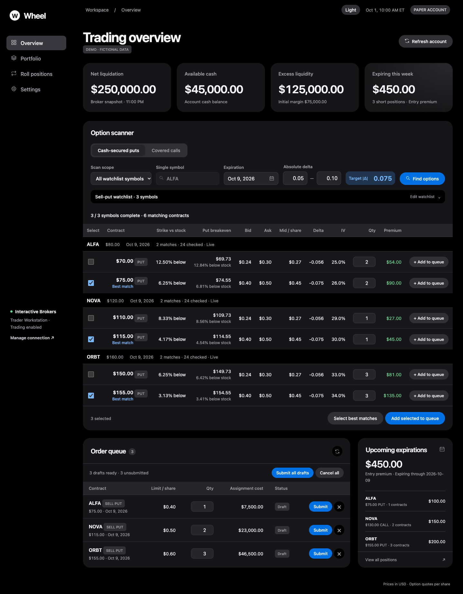

# Wheel

A local dashboard for Interactive Brokers. Scan options, track positions, and
manage draft orders with a clean dark or light interface.



## Set up in 3 steps

### 1. Get ready

- Install **[Python 3.10 or newer](https://www.python.org/downloads/)** and **TWS or IB Gateway**.
- [Download the latest release](https://github.com/xiao81/AllYouNeedIsWheel/releases/latest), unzip it, and open a terminal in that folder.
- Log into your broker app. In its API settings, enable **socket/API connections**.

### 2. Start Wheel

On macOS or Linux, paste these commands into the terminal:

```sh
python3 -m venv venv
source venv/bin/activate
python -m pip install -r requirements.txt
python run_api.py
```

On Windows, use `python` instead of `python3`, and replace the second line with
`venv\Scripts\activate` in Command Prompt.

### 3. Connect from the dashboard

Open **[Settings](http://127.0.0.1:8000/settings)**. Choose **Paper** or **Live** to
match your broker login, select **TWS** or **IB Gateway**, then click **Save settings**
and **Test connection**. No JSON editing. Account ID is optional.

Start with Paper and read-only mode. To submit orders later, disable read-only
mode in both Wheel and the broker's API settings.

## Daily use

Keep your broker app open. Activate the environment and run `python run_api.py`.
Open **[Wheel](http://127.0.0.1:8000/)**, edit your watchlist, and click **Find options**.
**Add to queue** saves a local draft; **Submit** asks you to confirm before sending
it to IBKR. Cancel submitted orders in your broker app.

Live quotes require the appropriate IBKR market-data subscriptions.

[Setup help and troubleshooting](docs/user-guide.md) ·
[What's new in v2.0.0](CHANGELOG.md) ·
[Light theme](docs/images/overview-light.png) ·
[Portfolio](docs/images/portfolio-dark.png) ·
[Settings](docs/images/settings-light.png)

All screenshots use fictional demo data. Licensed under [Apache 2.0](LICENSE).
